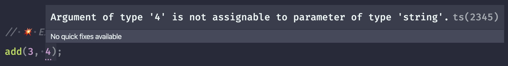
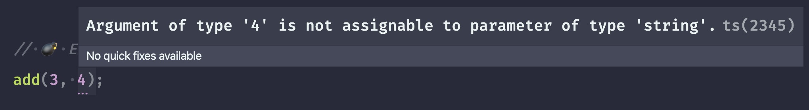
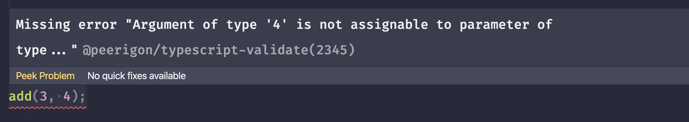

@peerigon/typescript-exercises-tools
=============================
**Validate TypeScript files with inline comments.**

[](https://www.npmjs.com/package/@peerigon/typescript-exercises-tools)
[](https://www.npmjs.com/package/@peerigon/typescript-exercises-tools)
[](https://david-dm.org/peerigon/@peerigon/typescript-exercises-tools)
[](https://travis-ci.com/peerigon/@peerigon/typescript-exercises-tools)
[](https://coveralls.io/github/peerigon/typescript-exercises-tools?branch=master)
[](https://snyk.io/test/github/peerigon/typescript-exercises-tools)

This module allows you to annotate expected type errors in your TypeScript code like this:

```ts
export const add = (a: number, b: string) => {
    return a + b;
};

// 💣 Expect error 2345: Argument of type '4' is not assignable to parameter of type...
add(3, 4);
```

With the TypeScript language server plugin provided by this module, these expected type errors will show up as a suggestion instead of an error:




Furthermore, these comments will cause the editor to show an error if there is *no type error* at this location:



At the time of writing, only editors use TypeScript language service plugins. Calling `tsc` from the command line will not execute the plugin. That's why there is also a programmatic API that allows you to do assertions on the program:

```ts
import {assertProgramToOnlyHaveExpectedErrors} from "@peerigon/typescript-exercises-tools";

test("The program has only expected errors", () => {
    assertProgramToOnlyHaveExpectedErrors("/path/to/module.ts");
});
```

This module is ideal for:

- testing types by doing assertions on the behavior of types
- creating TypeScript exercises

## Installation

```
npm install @peerigon/typescript-exercises-tools
```

Now you need to add the TypeScript language service plugin to your `tsconfig.json`:

```json
{
    "compilerOptions": {
        "plugins": [{
            "name": "@peerigon/typescript-exercises-tools/plugin"
        }]
    }
}
```

**Please note that you need to configure your editor to use your local TypeScript version.** Otherwise TypeScript may not find the plugin. If you're using VSCode, create a file in your repository at `.vscode/settings.json` and add this:

```json
{
    "typescript.tsdk": "node_modules/typescript/lib"
}
```

## API

### assertProgramToOnlyHaveExpectedErrors(<br>&nbsp;&nbsp;&nbsp;&nbsp;programPath: string,<br>&nbsp;&nbsp;&nbsp;&nbsp;compilerOptions?: ts.CompilerOptions,<br>): void

Compiles the program at the given `programPath` and throws the first unexpected error it encounters. It's recommended to use an absolute path. If you don't pass any `compilerOptions` to this function, it uses TypeScript's internal `findConfigFile()` to locate the closest `tsconfig.json` to `programPath`.

```ts
import {assertProgramToOnlyHaveExpectedErrors} from "@peerigon/typescript-exercises-tools";

assertProgramToOnlyHaveExpectedErrors("/path/to/module.ts"); // may throw

assertProgramToOnlyHaveExpectedErrors(
    "/path/to/module.ts",
    {strict: true} // custom compiler options
);
```


## License

Unlicense


## Sponsors

[](https://peerigon.com)
